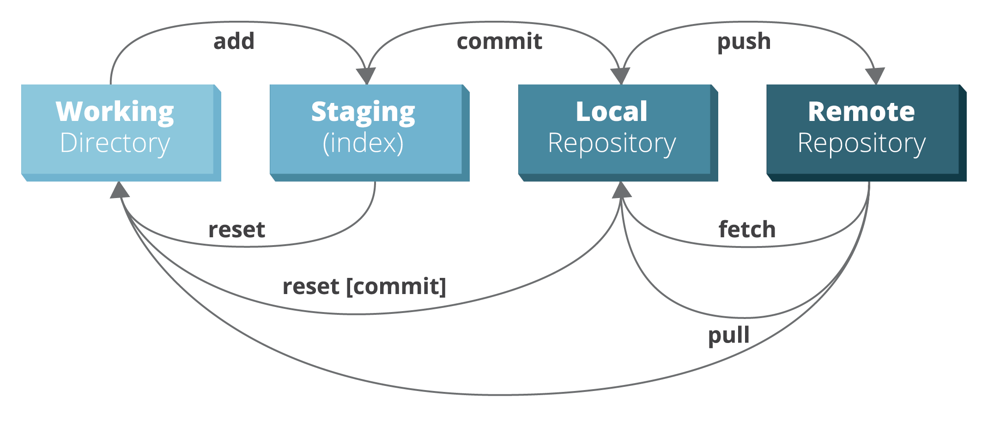
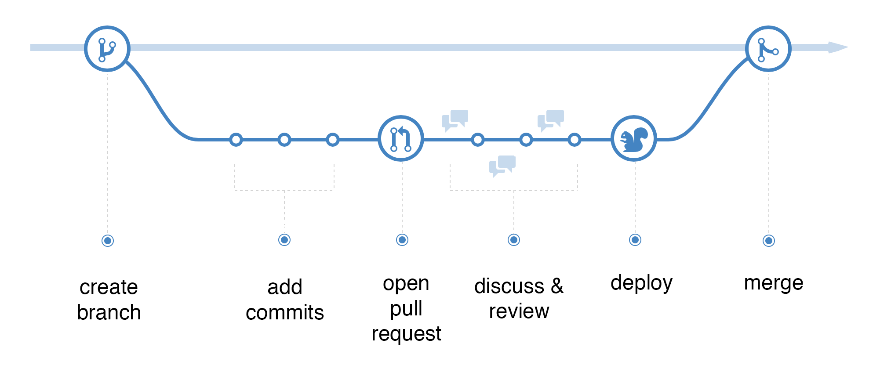
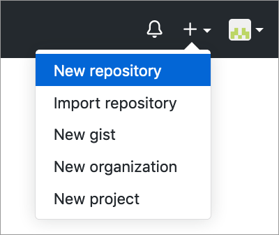
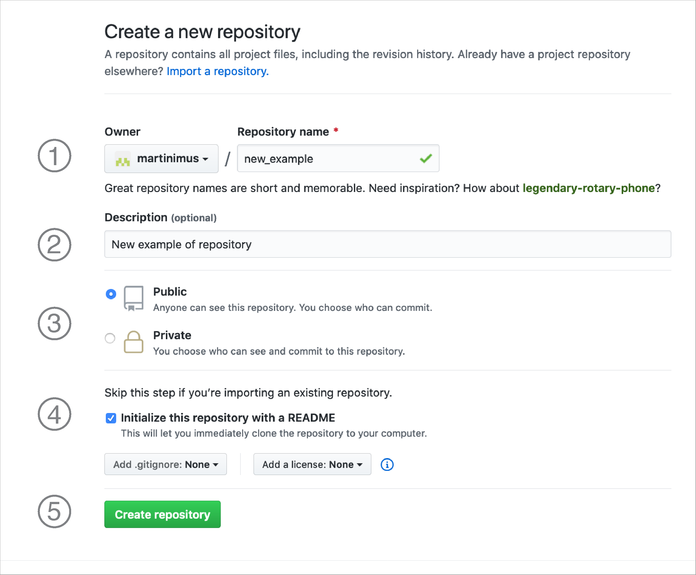
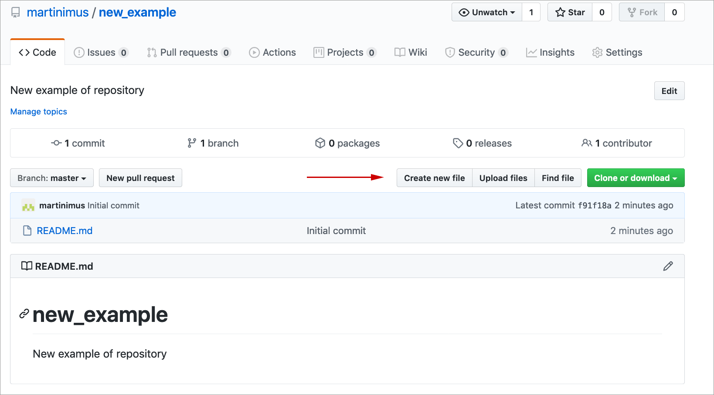
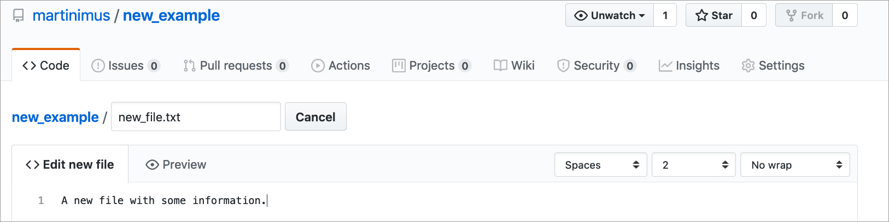
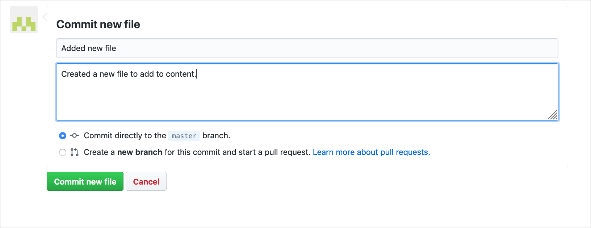
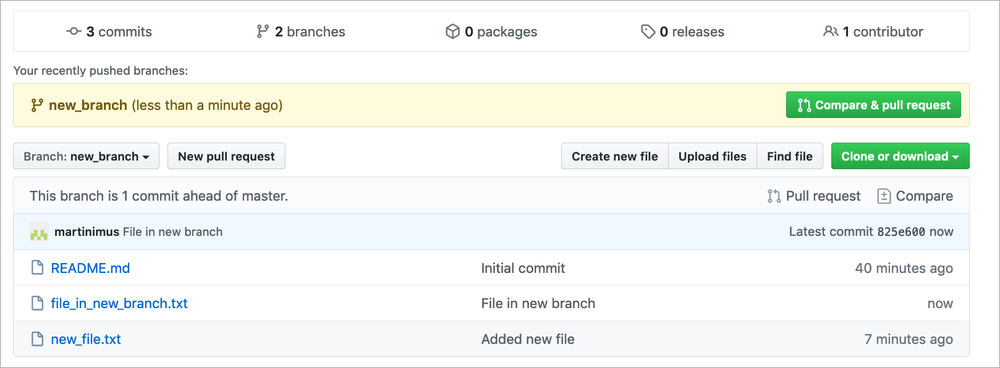
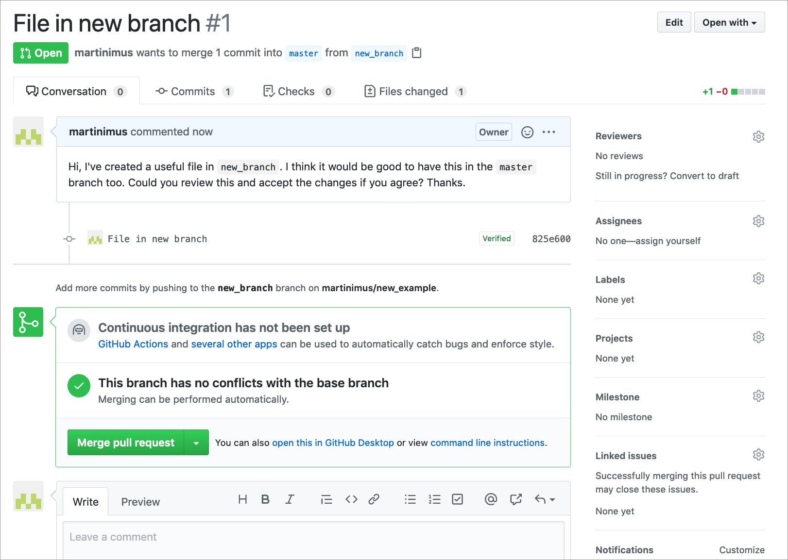
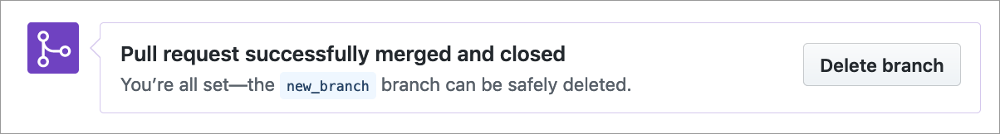

```{r, echo = FALSE, purl = FALSE, message = FALSE}
source("setup.R")
```

\

# Version control

I would imagine that most people here will have found themselves in this situation before:

```{r phdcomics, out.width="75%", fig.align='center', results='markup', echo=FALSE, purl=FALSE}
knitr::include_graphics("img/phdcomic.png")
```

I certainly have! And over the years I've tried different ways of organising revisions. For documents it works quite well to start your document title with a date, for example `2020-04-05_Project_analysis.docx` so that a new version would have a more recent data, such as `2020-05-08_Project_analysis.docx`. That way your revisions are organised in chronological order.

If you are working with multiple people on the same document you can add initials to the end, e.g. `2020-04-05_Project_analysis_JD.docx`, so you know who has reviewed/commented on the document. You can then merge documents within MS Word, if you're using that.

More recently, I've become a fan of [Google Docs](https://www.google.co.uk/docs/about/), which provides much of the functionality of MS Office, but allows you to work remotely on a document with other people. Changes are registered in its **History** and you can go back through time.

All this works reasonably well for documents, but this is less suitable for code, where changes are made often and have clear consequences on the workings of the code further down. This gets us to the topic of **version control systems**, of which [Git](https://git-scm.com) is one.

Git allows you to keep track of changes to your code _and_ share those changes with others. It works particularly well when used in conjunction with [GitHub](https://github.com), a website that enables sharing your code with others.

In general, there are two different types of version control systems: **centralised** and **distributed**. Both types of version control systems their changes in a database, called a **repository**. All work is done on a personal copy, called a **working copy**. We'll briefly go through the differences between how these two systems function in this context.

\

## Centralised version control systems

The centralised version control system has just one centralised repository. Each user has its own working copy to which changes are made. These changes are then communicated with the central server that holds the (centralised) repository. You commit your changes to the server, other users update and can directly see your changes.

```{r centralised_vc, results='markup', echo=FALSE, purl=FALSE}
knitr::include_graphics("img/centralised-vcs.png")
```

Image by Michael Ernst[^1].

\

## Distributed version control systems

The distributed version control system works a little different, where each user not only has their own working copy, but also their own repository. You commit your changes to your repository but other people cannot see those changes yet. For that to happen you need to push your changes to the central repository. You do not get other people's changes, unless you specifically pull those changes into your own repository.

```{r distributed_vc, results='markup', echo=FALSE, purl=FALSE}
knitr::include_graphics("img/distributed-vcs.png")
```

Image by Michael Ernst[^1].

[^1]: (https://homes.cs.washington.edu/~mernst/advice/version-control.html)

Here we will be using **Git**, which is a distributed version control system. Version control with Git works differently to all other version control systems in the way that it views the data. Whereas other version control systems store information as **changes to a base version** of a file (thus tracking how a file changes over time), Git stores data **as a snapshot of the project** over time. If a file has changed then Git stores the file again and if a file is unchanged then it links to the original, unchanged file.

As such, Git can be thought of as a mini file system[^2].

[^2]: https://git-scm.com/book/en/v2/Getting-Started-What-is-Git%3F

\

## Git workflow

Although Git can work entirely local, it is usually used in conjunction with a remote storage - in our case GitHub.

You have a **working directory** on your computer that contains all the files that you are working on. There is also a **local repository** inside your working directory that contains an object database with all the versions of the files, changes, commits etc. associated with your files. Lastly, there usually is a **remote repository** that contains a copy of your local files and local repository. In our case, this remote repository is on GitHub.

GitHub needs to know which files to track, which are added to the **index**. These files are staged for a **commit**, which creates a snapshot of your files in time. The commit is always accompanied by a message that explains what the changes are that are being committed.

When you are happy with the commit you've made on your (local) computer, then you can **push** these changes to your remote repository on GitHub and it will be updated.

```{r git_workflow, results='markup', echo=FALSE, purl=FALSE}

```

The image was adapted from the [RebelLabs Git Cheat Sheet](https://i.redd.it/8341g68g1v7y.png).

\

### Branches

If you are working on something by yourself then you're able to judge whether or not you want to push any changes to your remote repository. Things get a bit more complicated when you are working in a team, because multiple people could work on the same file and the changes you push could affect others. The way GitHub deals with this is through the use of **branches**.

Simply put, a branch is a copy of your repository where you can safely make changes/experiment without worrying how these changes might affect others.

There can be many different branches in your repository, but only one can be deployed: the `master` branch. So if you are making changes and push them to the `master` branch then they are immediately implemented.

We will learn how to [create branches](#create-branch) later.

Below is a schematic overview of the process you go through on GitHub.

```{r github_workflow, results='markup', echo=FALSE, purl=FALSE}

```

Image adapted from [the GitHub guide](https://guides.github.com/introduction/flow/).

\

## Starting on GitHub

### Creating a new repository

Start a new repository by navigation to the top right corner on GitHub:

```{r new_repo_01, results='markup', echo=FALSE, purl=FALSE}

```

This brings up a screen with the following options:

1. Name of repository you want to create
2. A short description of what the repository contains
3. Make the repository Public or Private
4. Check the `Initialize this repository with a README` to create a README file (recommended)
5. Create the repository

```{r new_repo_02, results='markup', echo=FALSE, purl=FALSE}

```

\

### Creating a new file

To create a new file, click on the `Create new file` button:

```{r new_file_01, results='markup', echo=FALSE, purl=FALSE}

```

You then have the possibility to create a new file, in this case we are calling it `new_file.txt`. Note the use of file extensions.

```{r new_file_02, results='markup', echo=FALSE, purl=FALSE}

```

To add the file you need to add a **commit message**. A commit message should be a brief description of what you've done. You can add more information on _how_ you have done things in the commit description.

Here we are adding it directly to the `master` branch. We will learn how to create branches next.

```{r new_file_03, results='markup', echo=FALSE, purl=FALSE}

```

\

### Creating a new branch {#create-branch}

You usually create a new branch if you want to add or change something in the `master` branch, but you're not entirely sure if it will work or affect others working on the same files. Creating a branch makes a copy of your repository that you can freely edit, without having to worry about these things. We will call this a `feature` branch.

To create a feature branch, click on the `Branch: master` button on the main repository page. This will display a list of branches (if there are any). To add a new branch simply type in the name you want and press `Enter`.

```{r new_branch_01, results='markup', echo=FALSE, purl=FALSE}
knitr::include_graphics("img/new_branch_01.png")
```

This `new_branch` will be the same as the `master` branch (because it is an exact copy). To generate some changes, we add a new file called `file_in_new_branch.txt`. Once committed, we are taken back to the main repository page (note that you are now in `Branch: new_branch` if you have created a branch called `new_branch`). Because you have made a copy of your repository and you have made some changes, GitHub now gives you the opportunity to compare your `new_branch` with the `master` branch.

Comparing the branches enables you to generate a **pull request**, which enables you to let people know that you have made changes. This means that people can review the changes and implement them. We will do that next.

```{r new_branch_02, results='markup', echo=FALSE, purl=FALSE}

```

\

### Pull requests {#pull-requests}

To start a pull request, press the `Compare & pull request` button. This takes you to a screen where you can add a message to whoever is maintaining the `master` branch, explaining what you have done in your `new_branch` and requesting to implement the changes.

```{r pull_request_01, results='markup', echo=FALSE, purl=FALSE}
knitr::include_graphics("img/pull_request_01.png")
```

After you press the `Create pull request` button you have the opportunity to merge the two branches. At the bottom of the screen you can write a message to the person who generated the pull request.

```{r pull_request_02, results='markup', echo=FALSE, purl=FALSE}

```

```{r pull_request_03, out.width="75%", results='markup', echo=FALSE, purl=FALSE}
knitr::include_graphics("img/pull_request_03.png")
```

After you have merged the branches your feature branch becomes obsolete, so you can decide to delete it. Unless you want to make more changes, but it would be best to start a new branch for that again.

```{r pull_request_04, out.width="75%", results='markup', echo=FALSE, purl=FALSE}

```

You are taken back to the main repository page once the pull request is merged with the `master` branch. You can see the changes have been implemented, because you now have a `file_in_new_branch.txt` in your `master` branch.

```{r pull_request_05, results='markup', echo=FALSE, purl=FALSE}
knitr::include_graphics("img/pull_request_05.png")
```

\

## Challenges

> ### Challenge 1 - New repository
>
1. Create a new repository on your GitHub account
2. Add a new file to the repository
>
> Remember the following:
> 
* Use a meaningful name for your repository
* Initialise the repository with a README file
* Add an extension to the file name when creating a new file

\

> ### Challenge 2 - Branches
>
1. Create a new branch
2. Make some changes to the branch by editting or adding a file
3. Commit the changes to the branch

\

> ### Challenge 3 - Pull requests
>
1. Open a pull request
2. Review the changes
3. Make more changes and push them
4. Review the new changes and commit them
5. Merge the branch with the `master` branch

\

## Glossary

The variety of phrases used in both types of version control systems can be a little overwhelming at times. Below is a non-exhaustive list of phrases you might come across. The glossary is an adapted version from [here](https://linuxacademy.com/blog/linux/git-terms-explained/).

* **branch** a version  of the repository that diverges from the main working project. Used to explore/test new features or make changes.
* **clone** a copy of a repository.
* **commit** stores the contents of the index (the staging area of Git) in a new commit. Needs to be provided with a commit message that explains what the changes are.
* **fetch** downloading and copying the files of a particular branch to your computer.
* **fork** creates a personal copy of somebody else's repository.
* **index** working or staging area of Git. This is where files that have been changed/added/deleted are kept until you are ready to commit the files.
* **master** the primary branch of all repositories.
* **merge** takes the changes from one branch and adds them to another (usually the `master` branch). These commits are normally first requested via a pull request.
* **origin** is the conventional name for the primary version of a repository. Git uses `origin` as a system alias for pushing and fetching data to and from the primary branch.
* **pull** or **pull request** a term used in GitHub to let people know you've pushed changes into a branch of the repository. These changes can then be reviewed by the repository maintainer and can be merged.
* **push** updates a remote branch with the commits made to the current branch. You are _pushing_ your changes onto the remote.
* **remote** a copy of the original branch. When you clone a branch, that new branch is a remote, or _clone_.
* **repository** In many ways, you can think of a Git repository as a directory that stores all the files, folders, and content needed for your project. What it actually is, is the object database of the project, storing everything from the files themselves, to the versions of those files, commits, deletions, et cetera. Repositories are not limited by user, and can be shared and copied.
* **upstream** While there is not necessarily a default “upstream” or “downstream” for Git projects, upstream can be considered where you push your Git changes — this is often the master branch of the project within the origin


