```{r, echo=FALSE, purl=FALSE, message = FALSE}
source("setup.R")
```

\

## Using GitHub from RStudio

Although you can do more or less all the version control aspects via the GitHub website, this is not very convenient when you are working on your R projects. Now you have an idea of how the GitHub workflow works, we can start to integrate these version control concepts with RStudio.

\

### Linking Git and RStudio

To use Git from within RStudio you need to make sure that Git can be found by RStudio.

If you haven't done so already, make sure to go to: `Tools` > `Global Options` > `Git/SVN` and check that 'Enable version control interface for RStudio projects` is enabled. Also, check that the path to Git is present and correct.

```{r git_options, results='markup', echo=FALSE, purl=FALSE}
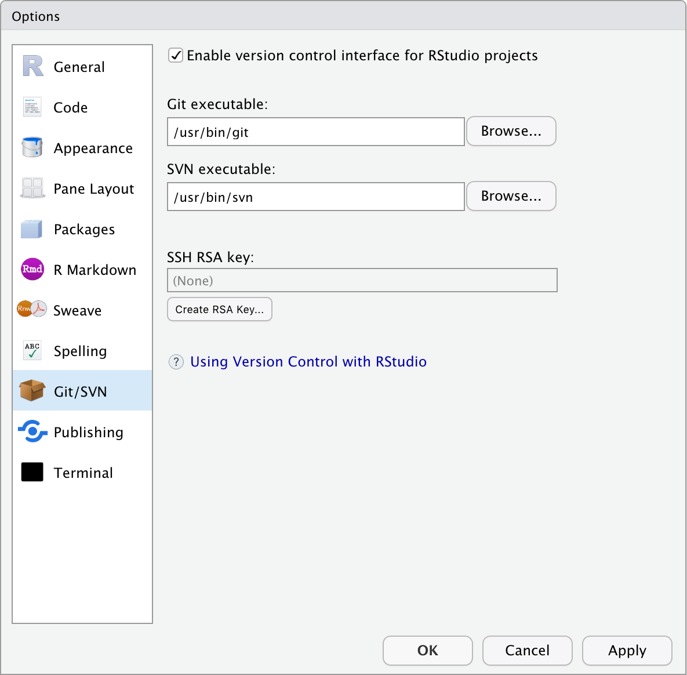
```

You also need to inform Git of your name and e-mail address so that it can label the commits with these details. To do this, go to `Tools` > `Shell` and provide the following details:

```
git config --global user.name "yourGitHubUsername"
git config --global user.email "name@provider.com"
```

You can verify that these are set up properly by running `git config --global --list` in the shell.

\

### Starting a new project under Git control

If you want version control of your R project, you need to make sure that the project is under control of Git.

The easiest way to start this is by creating a **new project** that is **linked to an existing GitHub repository**.

We can link a new project to the GitHub repository that we generated previously. To do this, we need to copy the URL for this repository. To do this, you have to go to the repository page and click on the `Clone or download` button. You can then copy the URL as shown below:

```{r git_rstudio_01, results='markup', echo=FALSE, purl=FALSE}
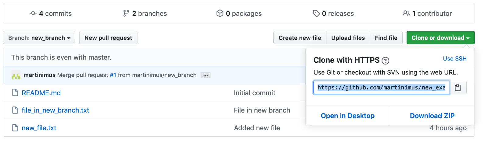
```

Next, we need to create a new project. Go to `File` > `New Project` > `Version Control` > `Git`.

```{r git_rstudio_02, results='markup', echo=FALSE, purl=FALSE}
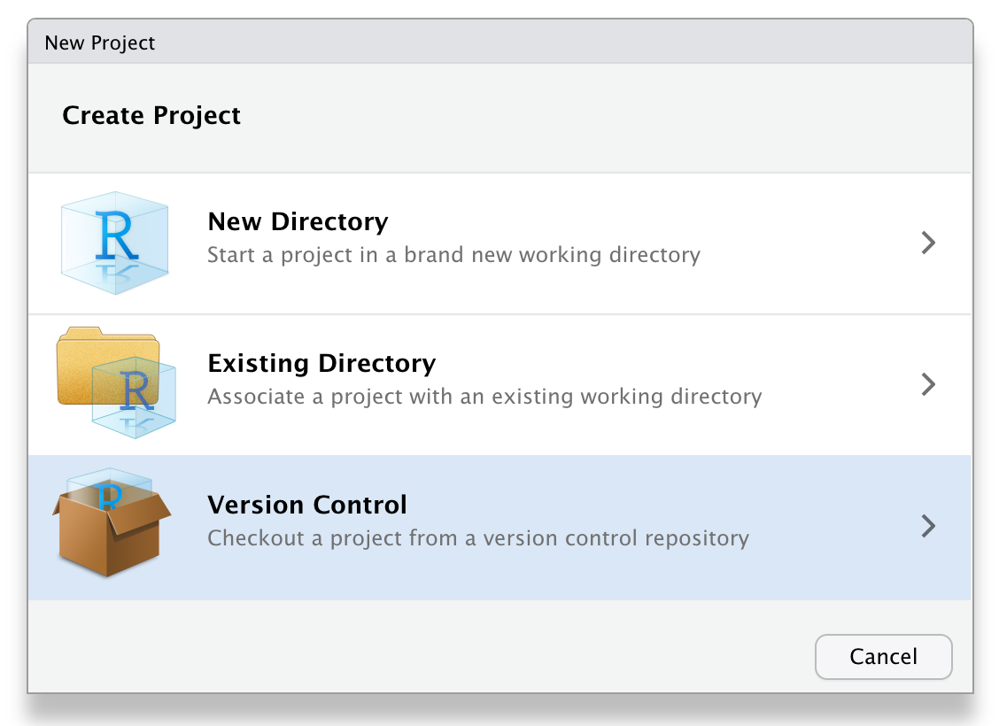
```

```{r git_rstudio_03, results='markup', echo=FALSE, purl=FALSE}
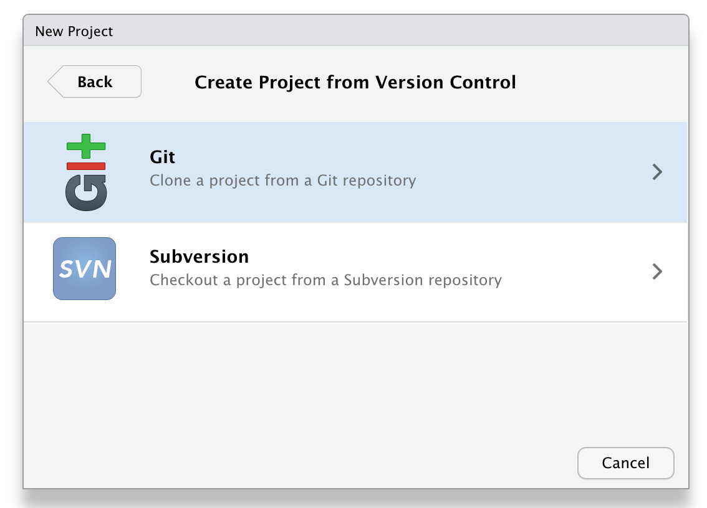
```

In `Repository URL` paste the link to your GitHub repository.
Give the project a name (avoid spaces and try to use a meaningful name) and tell RStudio where to save it.
It is useful to tick the `Open in a new session` box, so that your project opens in a new RStudio session. That way RStudio opens a session with a clean environment.

```{r git_rstudio_04, results='markup', echo=FALSE, purl=FALSE}
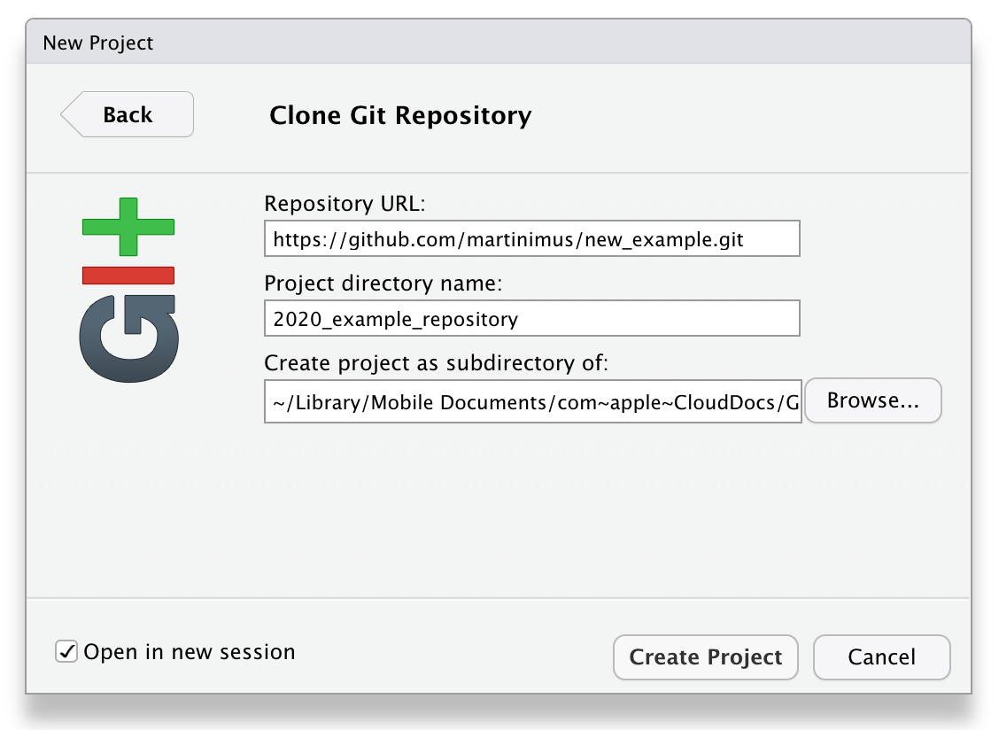
```

Your project will open and your RStudio session should now have an extra tab in the top right corner (where your Environment is), named `Git`. This is where all the changes will show up as you work on your project.

```{r git_rstudio_05, results='markup', echo=FALSE, purl=FALSE}
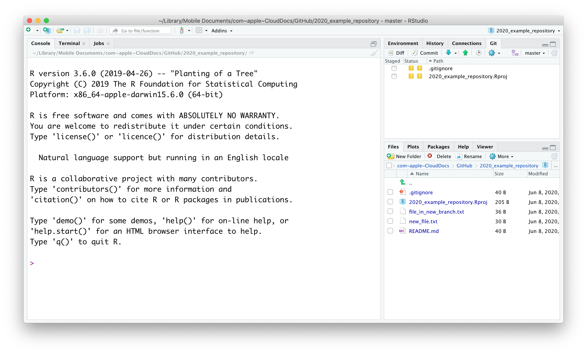
```

These options can also be found by using the
```{r git_toolbar_button, results='markup', echo=FALSE, purl=FALSE}

``` 
button in the toolbar. When you have opened a file and look at the options under this button it also enables you to find differences from the last commit (if there are any) or view the commit history of that file.

```{r git_rstudio_06, results='markup', echo=FALSE, purl=FALSE}
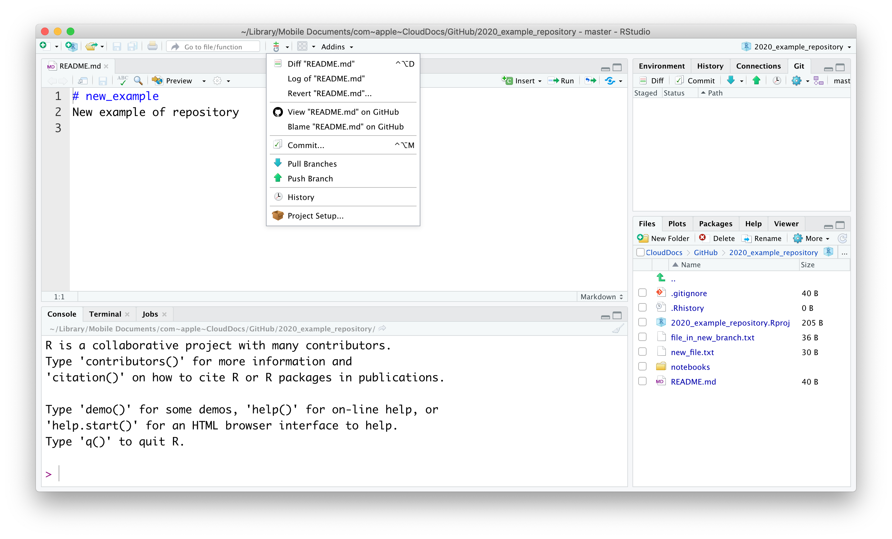
```

\

### Changes and your remote repository

Let's make some changes to our local repository, which is now under Git control. Here we are first creating a folder called `notebooks` and adding an R Markdown file named `01_import_and_clean_data.Rmd`.

Once you have created the file you'll see the folder appearing in the `Git` tab. When you tick the `Staged` box, the  `Status` changes to Added. This means that Git is tracking your file and will include it in the next commit.

```{r git_rstudio_untracked, results='markup', echo=FALSE, purl=FALSE}
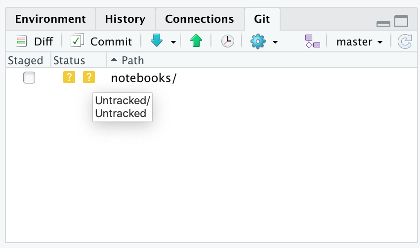
```

```{r git_rstudio_tracked, results='markup', echo=FALSE, purl=FALSE}
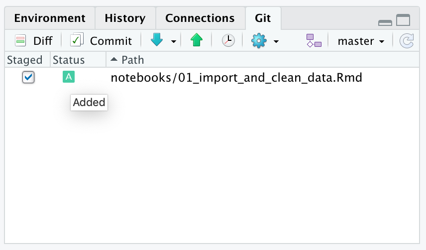
```

There are a few other icons that can appear in the Git pane, so here is an overview:

*
```{r results='markup', echo=FALSE, purl=FALSE}

```
, **untracked** file. Git has not seen this before and it needs to be added before changes are tracked.
*
```{r results='markup', echo=FALSE, purl=FALSE}

```
, **added** file. The file is now tracked by Git.
*
```{r results='markup', echo=FALSE, purl=FALSE}

```
, **modified** file. The file has been modified since the last commit.
*
```{r results='markup', echo=FALSE, purl=FALSE}

```
, **deleted** file. The file has been deleted since the last commit.

When we edit the file a bit we can see how it changed by clicking on the `Diff` button in the `Git` toolbar.

```{r git_rstudio_differences, results='markup', echo=FALSE, purl=FALSE}
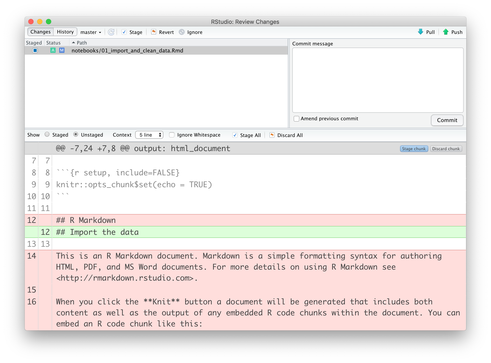
```

If we are happy with the changes then we can commit them. You can do this by pressing the `Commit` button in the `Git` tab and adding a commit message. All the files that are staged will be included in that particular commit. If there are files that you do not want to commit yet then you can untick them before pressing the `Commit` button.

```{r git_rstudio_commit, results='markup', echo=FALSE, purl=FALSE}
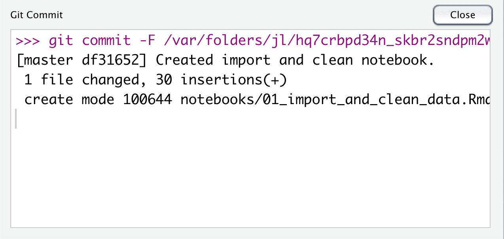
```

To ensure that the changes end up on your remote repository you need to **push** the changes. To do this, press the `Push` button in the top right corner. RStudio will give you a message that the changes are pushed:

```{r git_rstudio_push, results='markup', echo=FALSE, purl=FALSE}
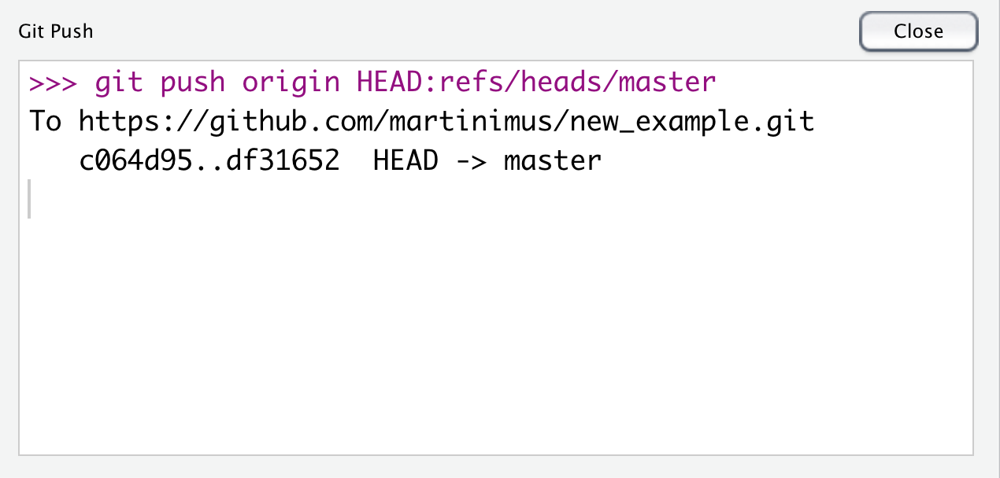
```

\

> ### Challenge 1 - Version control in RStudio
>
1. Create a new repository on GitHub
2. Create a new R Project under version control
3. Link the R Project with the remote repository
>

\

> ### Challenge 2 - Branching and changes
>
1. Create a new branch (e.g. `new_notebook`) from within RStudio. To do this, use the following button in the `Git` pane:
```{r new_branch_button, results='markup', echo=FALSE, purl=FALSE}
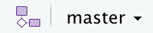
```
2. Create a `notebooks` folder and save a new R Markdown file in it.
3. Ensure that changes to the new file are tracked.
4. Make some changes to the file and commit them.
5. Push the changes to the remote repository.

\

> ### Challenge 3 - Pull requests
>
1. Go to your GitHub repository and navigate to the newly created branch
2. Create a pull request
3. Merge the pull request with the `master` branch
4. Congratulate yourself on being a version control Pro!

\

## Forking projects

So far we have used repositories that we created ourselves. But you might find that you want to add to somebody else's project. Or you like their project and want to adapt it to your needs. In that case you need to make a personal copy of that project. This is called **forking**.

To fork a repository you need to navigate to the repository page on the maintainer's GitHub account whilst logged into your own account. You then click on the `fork` button. The repository is then copied to your account:

```{r forking_01, results='markup', echo=FALSE, purl=FALSE}
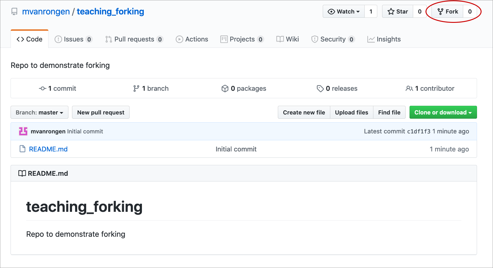
```

```{r forking_02, results='markup', echo=FALSE, purl=FALSE}
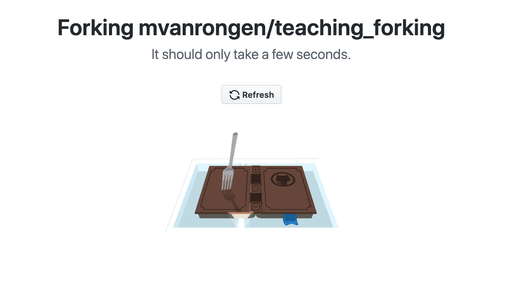
```

The forked repository will show up in your repository list. It will specify that it is a forked repository:

```{r forking_03, results='markup', echo=FALSE, purl=FALSE}
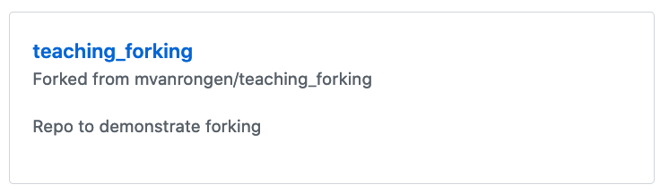
```

Once you have forked a repository to your GitHub account you can make changes to it. Good practice is to create a **new branch** in your copy of the repository, so that you do not run the risk of confusing the `master` branch of your copy with the `master` branch of the original repository.

In this case we're adding a new branch called `new_feature`.

After you have created a new branch on your forked copy you can start editing/adding as you like. You do this as you have done before, by **staging** and **committing** changes to your repository.

When you want to suggest incorporating some of these changes into the original repository you will have to open a **pull request**. This works in the same way is described in the [pull requests](#pull-requests) section, but instead of comparing two branches on the same repository, you are comparing the branch on your forked copy with the `master` branch of the original repository.

Your pull request will show up in the original repository. Note that you can also see that the original repository has been forked:

```{r forking_04, results='markup', echo=FALSE, purl=FALSE}
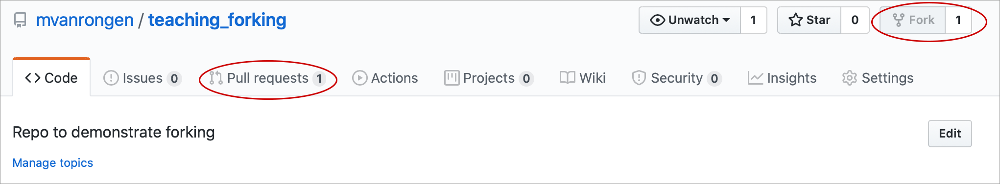
```

\

## Creating issues

GitHub keeps track of bugs, improvements and tasks through **Issues**. The good thing about issues is that they can be shared and discussed with collaborators, in a similar way as to how the pull request system works.

An issue is created from the `Issues` tab in the repository:

```{r issues_01, results='markup', echo=FALSE, purl=FALSE}
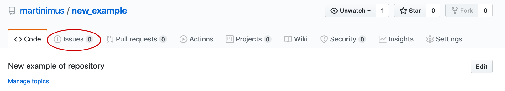
```

A new issue requires a title and description. It's good to try and be as concise and complete as possible so that the developer knows what it is that you want. You can label the issue - in this case it is an Enhancement, but there is a whole range of labels you can choose from. Labelling can be particularly helpful when there are many issues and it helps you organise and prioritise your work.

```{r issues_02, results='markup', echo=FALSE, purl=FALSE}
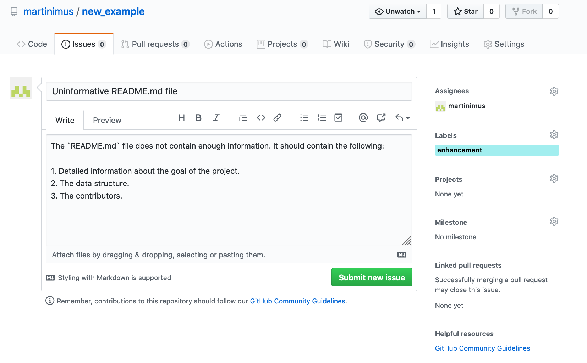
```

Issues are always assigned a unique ID, which you can use to refer to them in comments:

```{r issues_03, results='markup', echo=FALSE, purl=FALSE}
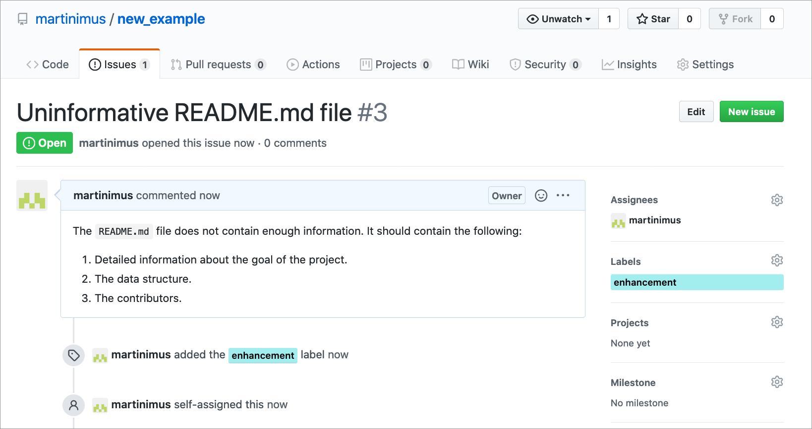
```

```{r issues_04, results='markup', echo=FALSE, purl=FALSE}
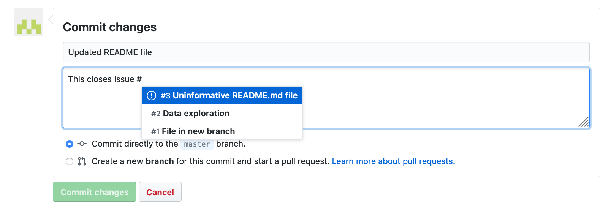
```

\

## Managing access

When you have a public repository everyone can fork the repository and make changes to that (forked) copy. You can also invite people to collaborate on your project.

In order to do that you need to go to the `Settings` > `Manage access` page:

```{r manage_access, results='markup', echo=FALSE, purl=FALSE}
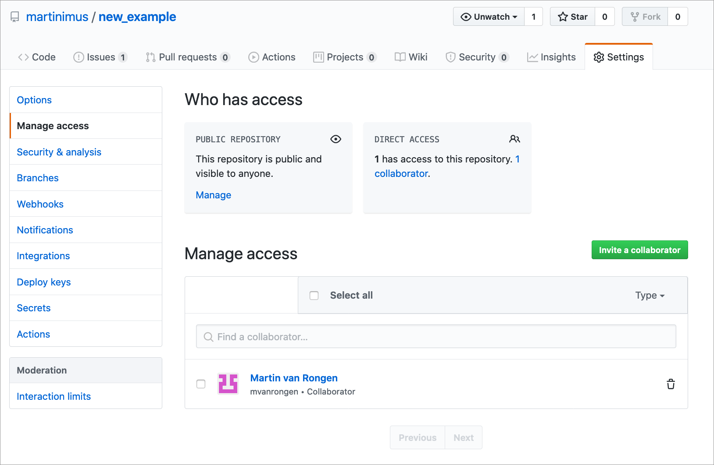
```

Here you can invite collaborators and once they have accepted, then can open pull requests and make changes to the repository.

To find repositories where you are a collaborator on you need to go to `Settings` > `Repositories`. Unfortunately these repositories do not show up on your own Repositories tab.

```{r manage_collaborative_repo, results='markup', echo=FALSE, purl=FALSE}
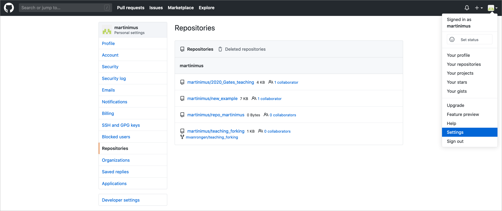
```

\

## Challenges

Below are several challenges that incorporate some of the topics that we have covered throughout the course.

To practice collaboration we are teaming up. For these challenges we will work in pairs. Both people will create a repository which contains their GitHub username in the title (`repo_<GitHubUserName>`, e.g. `repo_martinimus`). Then each person adds the other one as a collaborator.

Once you are added as a collaborator, you link the collaborative repository (i.e. the repository where you were added as a collaborator, _not_ your own) to RStudio and make some changes that you suggest to your collaborator by creating a pull request. Your collaborator will then assess the changes and you can have a bit of back-and-forth before accepting and merging the changes.

\

> ### Challenge 1 - Creating a repository for collaboration
>
1. Create a new repository on GitHub. Name it `repo_<GitHubUserName>`, e.g. `repo_martinimus`.
2. Find a collaborator and ask to be added as a collaborator to their repository. You should get a verification e-mail on the e-mail address that is registered with your GitHub account. Verify and check that the repository shows up on your GitHub page (remember, these will be in `Settings` > `Repositories`).
3. Put the collaborative repository under version control in RStudio (e.g. `repo_<GitHubUserNameCollaborator>`).

\

> ### Challenge 2 - Making and discussing changes
>
1. Create a new branch on the collaborative repository, either through RStudio or the GitHub website.
2. In RStudio, create a new R Markdown file in the collaborative repository and **stage**, **commit** and **push** the changes to the branch you have just created.
3. Go to the repository you are both working on and start a **pull request** for the changes you just pushed.
4. To practice, let the collaborator **comment** on the changes and ask for more details instead of merging the pull request.
5. Amend the R Markdown file again with the requested details and commit/change/push again.
6. The collaborator can now accept the changes and **merge** the branches.

